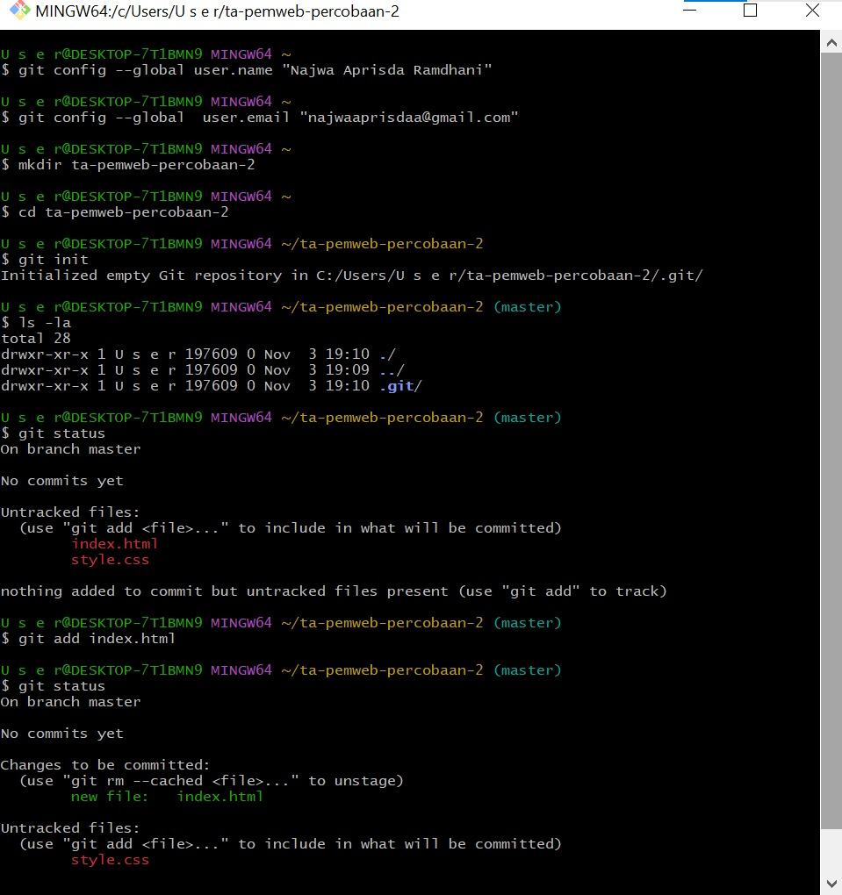
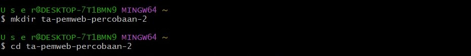
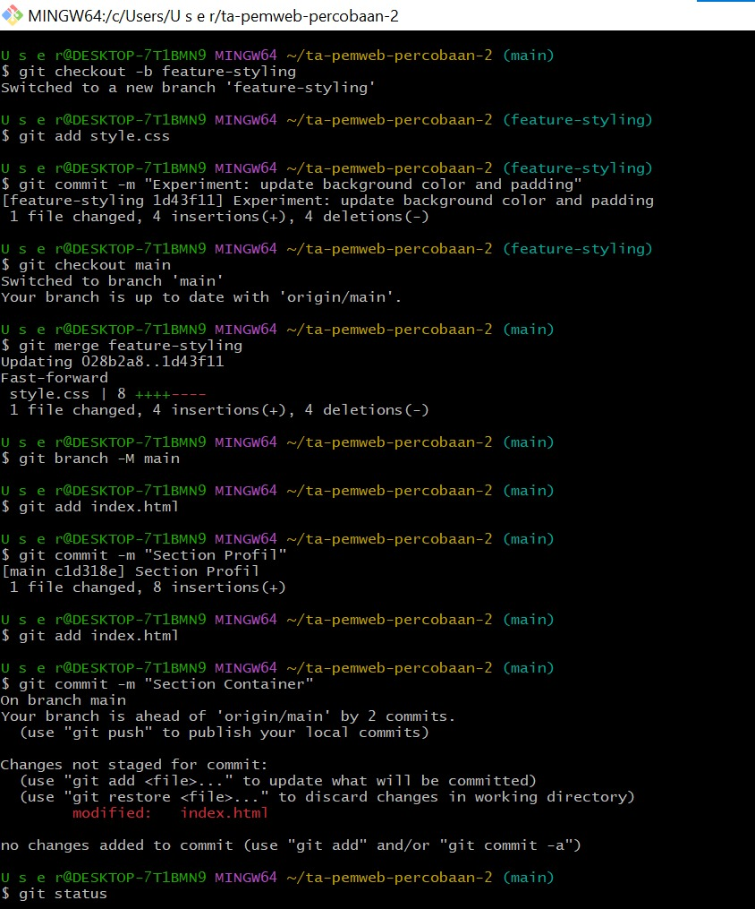
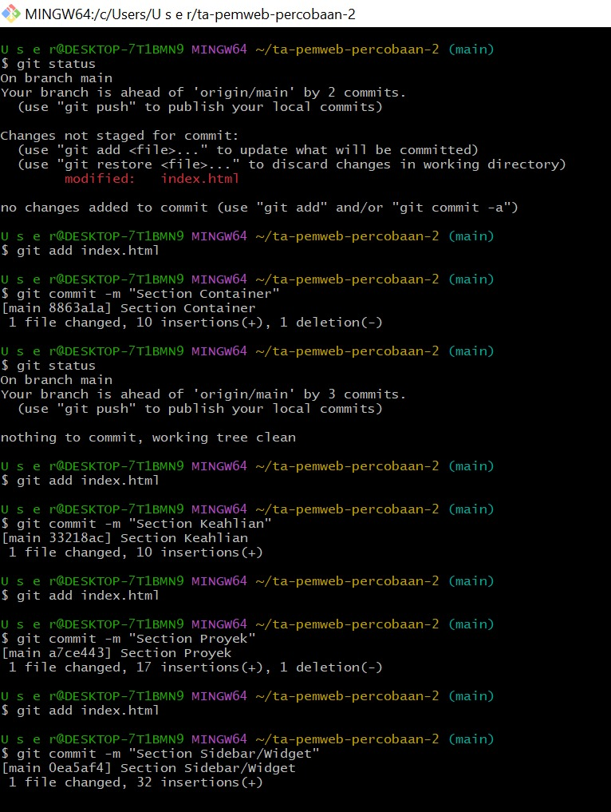
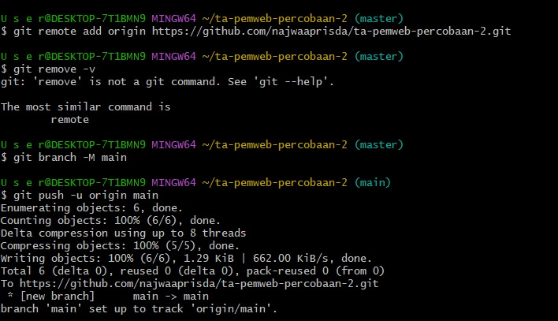

# Portofolio Najwa Aprisda

Proyek ini merupakan website portofolio pribadi yang menampilkan informasi tentang profil, keahlian, proyek, dan kontak.  
Dibangun sebagai bagian dari tugas *Praktikum Pemrograman Web* dengan tujuan memperkenalkan diri secara profesional menggunakan teknologi web dasar.

# Struktur Folder
ta-pemweb-percobaan-2/  
├── index.html  
├── style.css  
├── foto.jpg  
└── README.md\

## **Section pada index.html**
1. **Container Utama (`.container`)**
2. **Content Section (`.content`)**
3. **Sidebar (`.sidebar`)**
4. **Contact Section (`#kontak`)**
5. **Footer (`.footer`)**

## **Teknologi yang Digunakan**
- **HTML5** → Struktur konten dan elemen halaman.  
- **CSS3** → Desain tampilan, layout, dan efek visual.  
- **VS Code** → Text editor untuk pengembangan web.  
- **Git & GitHub** → Version control dan penyimpanan kode.

## **Cara Menjalankan Proyek**

# WORKFLOW GIT

1. Instalasi dan Konfigurasi Git
   

2. Membuat Repository Lokal
   - Buat direktori project baru:
      
   - Inisialisasi Git repository:
      

3. Commit dan History
   
   
   
   .jpg)
   
   .jpg)
   
5. Branching dan Merging
    .jpg)

6. Remote Repository dengan GitHub
   
   

